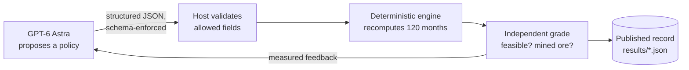
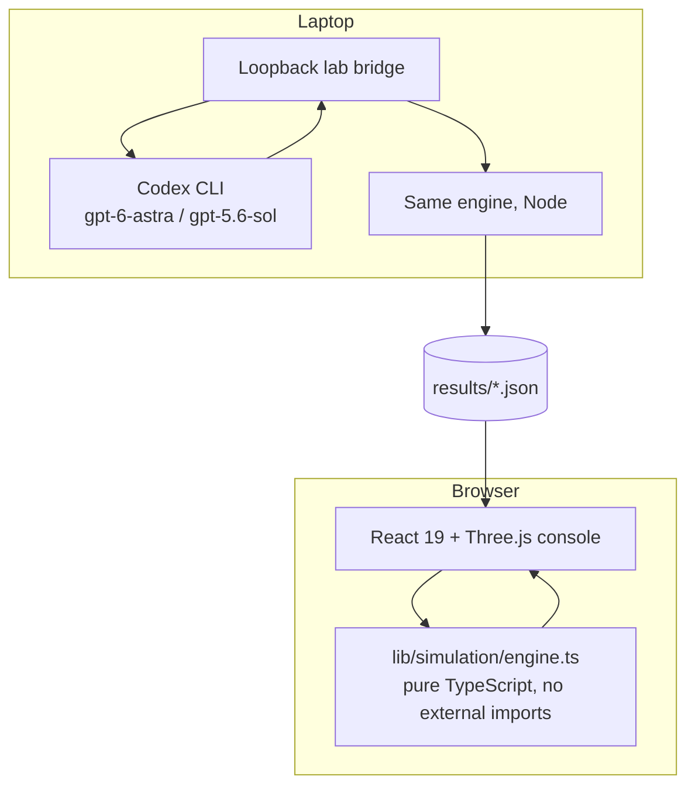

<div align="center">

<a href="https://starbound.vnmoorthy.chatgpt.site">
  
</a>

# StarBound

### Build a civilization powered by a star. Then let the physics argue back.

**An interactive Dyson swarm laboratory.** Robotic industry on Mercury, solar collectors in heliocentric orbit, power beamed to Earth.
Mission controls rerun a conservation-checked monthly model; landing, launcher-sizing and civilization controls run separate engineering calculators. GPT-6 Astra proposes bounded mission policies, which the host engine independently evaluates.

[](https://starbound.vnmoorthy.chatgpt.site)

[](https://github.com/vnmoorthy/starbound/actions/workflows/ci.yml)
[](tests)
[](package.json)
[](tsconfig.json)
[](components/orbital-scene.tsx)
[](docs/ASTRA.md)
[](LICENSE)

[**Launch the simulator**](https://starbound.vnmoorthy.chatgpt.site) · [**Mission briefing deck**](deliverables/StarBound-Mission-Briefing.pptx) · [**The physics**](docs/PHYSICS.md) · [**The Astra experiment**](docs/ASTRA.md) · [**Architecture**](docs/ARCHITECTURE.md)

*Hero image is generated concept artwork. The opening view supports drag and zoom. Choose **Live orbits** for the orbital visualization, with an interactive projected fallback when WebGL is unavailable.*

</div>

---

## Why this exists

Dyson swarm imagery conveys enormous scale. StarBound explores a different question: how do material supply, cooling and power transmission constrain a proposed system?

StarBound enforces its declared physical constraints within an explicitly simplified model.

- **Mass is accounted for.** Mined ore plus consumed imports equals tailings plus new factory mass plus active and retired collector mass. The engine records monthly residuals; its audit threshold is `1e-8 × max(1 kg, manufactured mass)`, not a fixed absolute tolerance.
- **Energy is budgeted.** Mining, refining, manufacturing and electromagnetic launch each cost joules. Production stalls when the joules run out.
- **Cooling constrains output.** At 0.3 AU and radiator ratio 0.5, the modeled temperature exceeds the default 600 K design limit and the engine disables orbital electrical output. This is a model rule, not a validated failure prediction.
- **Delivery constrains useful power.** Under the baseline parameters, switching from optical relay to direct interplanetary microwave changes Earth delivery from **13.23 MW to 127 W**. These are architecture-specific scenario results, not universal limits.
- **The AI does not get to grade its own homework.** GPT-6 Astra proposes. A deterministic TypeScript engine evaluates. Both records are public.

## Sixty seconds in the simulator

<table>
<tr>
<td width="50%"></td>
<td width="50%"></td>
</tr>
<tr>
<td align="center"><sub>Mercury industrial seed (generated concept)</sub></td>
<td align="center"><sub>Collector and radiator (generated concept)</sub></td>
</tr>
</table>

1. **Break the thermal budget.** Orbital radius to 0.3 AU, radiator ratio to 0.5. Watch the design temperature hit 783 K and orbital electricity read exactly zero. Add radiator area to recover.
2. **Lose the beam.** Reset, then switch the Earth link to direct microwave. 13.23 MW becomes 127 W with the baseline mission settings and the newly selected architecture.
3. **Block the Sun.** Set the Earth phase angle to 180°. The line of sight crosses the solar disk and delivery drops to nothing.
4. **Shut down the robots.** Open Robot control and put the excavation fleet in safe mode. Follow the missing feedstock through refining, manufacturing and launch.
5. **Ask Astra.** Open the Astra lab, apply its recorded first proposal, and watch the engine recompute the trajectory it was graded on.

Ten scenario presets ship with the app (nine perturbations plus the baseline): collector thermal failure, direct microwave challenge, excavation robots offline, factory assembly shutdown, high pointing jitter, launcher failure at year 3, no precision imports, refinery shutdown, Sun blocks Earth transmission, and the baseline with finite imports.

## What is in the console

| Tab | What you control | What pushes back |
|---|---|---|
| **Mission control** | Orbit radius, efficiency, collector mass, radiator ratio, retirement | Live 3D swarm, design temperature, 30-year power trajectory, bottleneck readout |
| **Robot control** | Excavation availability, safe mode, comms-loss drill, seed delivery, landing mass | Feedstock starvation propagating downstream |
| **Manufacturing** | Refinery and assembly availability, ore yield, factory expansion, energy reinvestment | Conserved mass ledger, collector bill of materials |
| **Collector control** | Orbit, radiator ratio, retirement, launcher throughput; separate acceleration, payload and charging-power inputs | Calculated track length, pulse power, escape and transfer bounds |
| **Earth power** | Ground receiver diameter, pointing jitter, phase geometry, link mode; additional apertures in Mission control → link | Gaussian capture, assumed 10 W/m² peak-intensity ceiling, grid cap, occultation |
| **Civilization** | Capture fraction, habitat geometry, computing radiators, kinetic energy | Near-total-capture mass and heat bounds |
| **Build sequence** | Read the six-stage construction sequence | Material ledger for the current mission |
| **Astra lab** | A bounded policy objective | Independent grading, Sol baseline, brute-force search |
| **Research** | Read methods and follow source links | Documented equations, assumptions and limitations |

Import or export a complete mission as JSON. Download the monthly trajectory as CSV. No account required.

## The Astra experiment

The challenge: deliver **at least 10 MW to Earth at month 120**, after a 75% availability factor, while mining as little Mercury ore as possible. Astra may change five policy fields. It cannot touch constants, budgets or the grader.



Astra's first proposal identified the receiver-saturation issue already visible in the baseline feedback and proposed reducing production. The host verified the result. It cut mined ore from **3.92 Mt to 0.128 Mt** while still meeting the target.

| Method | Evaluations | Best mined ore | Endpoint Earth power | Wall clock |
|---|---:|---:|---:|---:|
| **GPT-6 Astra** | 3 proposals | 0.128494 Mt | 13.233 MW | 162 s |
| GPT-5.6 Sol | 3 proposals | 0.128494 Mt | 13.233 MW | 249 s |
| Coarse grid search | 1,008 simulations | 0.128494 Mt | 13.233 MW | 0.5 s |

**They tied.** We are publishing that, because a benchmark you only report when you win is not a benchmark. Several tested zero-expansion, zero-reinvestment policies reached the same score. This narrow experiment did not separate the models. The protocol, the raw records, and the harder follow-up task are all in [docs/ASTRA.md](docs/ASTRA.md).

The point was never that Astra beats Sol at Dyson spheres. The point is a loop where an AI's engineering reasoning has to survive a reality check it does not control, with every attempt on the record.

[Astra record](results/astra.json) · [Sol record](results/sol.json) · [Search record](results/search.json) · [Comparison](results/comparison.json) · [Protocol](docs/ASTRA.md)

## Run it

Requires **Node.js 24+**.

```bash
git clone https://github.com/vnmoorthy/starbound.git
cd starbound
npm ci
npm run dev -- --hostname 127.0.0.1 --port 3000
```

```bash
npm test                    # 20 physical-invariant and boundary tests
npm run typecheck           # strict TypeScript
npm run build               # production build
npm run simulate            # standalone numerical summary
npm run experiment:search   # deterministic 1,008-point reference
```

### Run Astra live on your own machine

The repo ships the official Codex CLI. Live runs use **your** login and quota. The public site never sees your credentials.

```bash
npx codex login status      # or: npx codex login
npm run lab
```

Open the temporary local URL it prints. The bridge binds to loopback only, requires a per-process token, and accepts one run at a time. To regenerate the published records:

```bash
npm run experiment:astra
npm run experiment:sol
node scripts/summarize-results.mjs
```

## How it is built



The monthly engine runs in both the browser and Node experiments. Separate engineering calculators supply landing, launcher and civilization diagnostics. The recorded 100-run mean for a default 30-year simulation was 0.522 ms on macOS arm64 with Node 24.14.1; this is not a browser frame-rate or cross-device benchmark. Physical metrics and scores are host-calculated; model-written explanations are shown separately.

| | |
|---|---|
| Engine | Deterministic TypeScript, monthly steps, SI units, mass residual checked every step |
| Physics | Inverse-square flux, Stefan–Boltzmann thermal balance, Gaussian-beam diffraction, Mercury escape energetics, Hohmann bounds, rocket equation |
| UI | React 19, Three.js on demand, Tailwind, shadcn primitives, reduced-motion aware, WebGL fallback |
| AI loop | Codex CLI, `--output-schema` enforced JSON, read-only sandbox, array arguments (proposal fields are validated; the host invokes fixed command arguments) |
| Tests | 20 invariants: conservation, thermal cutoff, occultation, link caps, input rejection, grader independence |
| Hosting | OpenAI site hosting, static replay, zero server-side secrets |

Deeper reading: [Architecture](docs/ARCHITECTURE.md) · [Physics](docs/PHYSICS.md) · [Mercury-to-Earth sequence](docs/MERCURY-TO-EARTH.md) · [Research register](docs/RESEARCH.md) · [Validation record](docs/VALIDATION.md) · [Claim audit](docs/CLAIM-AUDIT.md)

## What the power could do

At the baseline year-30 snapshot, Earth receives about **13.23 MW**, roughly 0.116 TWh per year. That is one of: 29 million m³ of desalinated water, 2,109 tonnes of hydrogen, 29,000 household-years of electricity, or a 13 MW compute facility. Pick one. They share the same budget. Conversion assumptions are in [the physics doc](docs/PHYSICS.md#7-what-useful-power-means).

## Where the model stops

This is a reduced-order engineering model, not a construction plan.

The seed plant, imported precision components and Earth relay are assumed endowments. Extraction chemistry, real manufacturing readiness, collision-free trajectories, station keeping, relay cooling, weather and lifecycle economics are not validated. The moving swarm is a representative orbit sample, not an integrated ephemeris. Dense-swarm radiative feedback on the star, the open problem in Wright's review, is outside the sparse model. Robots are represented by aggregate availability, not simulated navigation. The monthly engine stops growth at 1% projected coverage; near-total-capture estimates are separate diagnostic bounds, not a dense-swarm simulation.

No construction date, energy price, demand, or model superiority is claimed. If you can break an invariant or source a better constant, [open an issue](https://github.com/vnmoorthy/starbound/issues). Reproducible failures are the most useful contribution.

## Roadmap

- [ ] Harder Astra task with a held-out fault revealed after round one, scored on cumulative delivered energy with a real interior optimum
- [ ] Thermal margin enforced in the grader, not just documented
- [ ] Explicit inventories and factory lead times
- [ ] Return-link geometry and orbital trajectories
- [ ] Uncertainty bands on every headline number
- [ ] Independent domain review

## Research and inspiration

- Jason T. Wright, [*Dyson Spheres*](https://arxiv.org/abs/2006.16734), Serbian Astronomical Journal 200 (2020)
- NASA/JPL, [planetary physical parameters](https://ssd.jpl.nasa.gov/planets/phys_par.html)
- NASA, [Mercury surface mineralogy](https://ntrs.nasa.gov/citations/20160002643)
- NASA OTPS, [space-based solar power assessment](https://www.nasa.gov/organizations/otps/space-based-solar-power-report/)
- Kurzgesagt, [*How to Build a Dyson Sphere*](https://www.youtube.com/watch?v=pP44EPBMb8A)

## Contributing and license

Built by [**vnmoorthy**](https://github.com/vnmoorthy) at the GPT-6 Astra Hackathon SF, September 8, 2026, with AI assistance. See [CONTRIBUTING.md](CONTRIBUTING.md) and [THIRD_PARTY.md](THIRD_PARTY.md). Code is [MIT](LICENSE). Mission-briefing aesthetic is original; no affiliation with SpaceX, NASA, OpenAI or the cited authors is implied.

<div align="center">

**If the numbers pushing back made you smile, a star helps other people find this.**

[](https://github.com/vnmoorthy/starbound)

</div>
