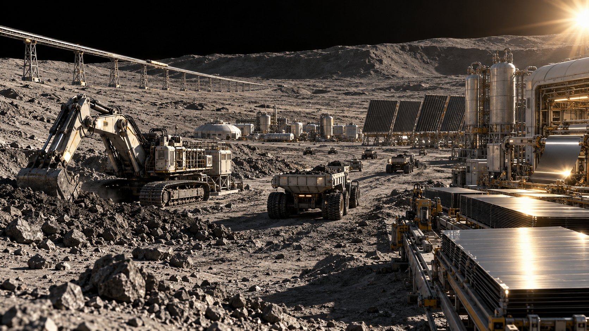
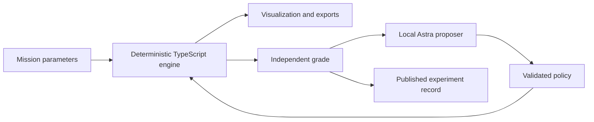

<div align="center">

# StarBound

### Build a star-powered future.

A Dyson swarm laboratory with **Astra-directed experiments** and an independent physics engine.

[**Launch the simulator ↗**](https://starbound.vnmoorthy.chatgpt.site) · [**Mission briefing — PowerPoint**](deliverables/StarBound-Mission-Briefing.pptx) · [**Architecture**](docs/ARCHITECTURE.md) · [**Equations**](docs/PHYSICS.md)

[](https://github.com/vnmoorthy/starbound/actions/workflows/ci.yml)


</div>

[](https://starbound.vnmoorthy.chatgpt.site)

*Mercury industrial concept generated for StarBound; the live simulator contains the interactive 3D scene.*

**What if an AI had to defend a megastructure plan against a material ledger, a thermal limit, and a real transmission budget?**

StarBound follows a hypothetical Mercury industrial seed through mining, refining, manufacturing, launch, solar collection and electricity delivery to Earth. Change the mission and the engine recalculates every result. Ask Astra for a policy, let the engine evaluate it, then inspect its revision.

This is a working **reduced-order simulation and AI experiment testbed**. It is not a validated plan to build a Dyson sphere or a claim that Mercury electricity is economically viable.

## Explore the mission

- **Mission control:** a Three.js solar swarm with orbit cameras, live parameters, ten failure cases, a monthly timeline and power trajectory.
- **Robot control:** excavation availability, safe mode, a communications-loss exercise, seed-delivery sequence and landing-mass calculator.
- **Manufacturing:** refinery/assembly availability, material recovery, factory expansion, energy reinvestment and a collector bill of materials.
- **Collector control:** orbit/radiator/retirement controls plus electromagnetic launch, rail length, pulse-power and insertion diagnostics.
- **Civilization:** near-total-capture mass/heat bounds, Earth illumination, computing radiators, interstellar kinetic energy and rotating-habitat geometry.
- **Build sequence:** six conceptual missions and a conserved material ledger.
- **Energy & impact:** optical-relay vs direct-microwave propagation, conversion losses, receiving limits and mutually exclusive useful-power equivalents.
- **Astra lab:** real recorded v1 GPT-6 Astra experiments, independently recomputed policies, a Sol comparison and an optional local live runner.
- **Methods:** physical equations, explicit engineering assumptions, primary sources and open questions.

Import/export a complete mission as JSON or download the monthly trajectory as CSV. No model account is needed to explore the public simulator or replay.

## Three things to try

1. Move collectors to **0.3 AU** and set radiator ratio to **0.5**. The design exceeds its assumed 600 K limit; orbital electrical output becomes zero. Increase radiator area to recover.
2. Reset, then switch the Earth link from **optical relay** to **direct microwave**. With the baseline apertures, diffraction reduces grid output from about **13.23 MW** to **127 W**.
3. Apply Astra's first recorded policy. It meets the fixed Earth-power target using less mining by avoiding unnecessary factory expansion.

The numerical outcomes are conditional on the declared mission, including a fixed receiver and a 10 W/m² peak-intensity design ceiling. They are not universal limits on all power-transmission designs.

## What Astra actually did

The fixed challenge asks for at least **10 MW at the month-120 endpoint**, after the assumed availability factor, while minimizing mined Mercury ore. Both models get the same starting mission, schema, assumptions, three-proposal limit and requested high effort. Each sees only its own previous measured feedback.

| Method | Evaluations | Best mined ore | Endpoint Earth power |
|---|---:|---:|---:|
| GPT-6 Astra | 3 proposals | 0.128494 Mt | 13.233 MW |
| GPT-5.6 Sol | 3 proposals | 0.128494 Mt | 13.233 MW |
| Conventional coarse grid | 1,008 simulations | 0.128494 Mt | 13.233 MW |

The measured records use engine v1.0. New v1.1 availability defaults preserve its baseline outputs; the new failure controls are not a new model benchmark.

**The mining score tied.** This challenge does not establish an Astra-only capability. Astra's three rounds took 161.9 seconds and Sol's 249.4 seconds in these runs; one experiment is not a general latency benchmark. Search uses a different evaluation budget.

The useful result is a falsifiable decision: the initial policy overbuilds for the fixed receiving facility. The ten-year baseline mines 3.92 Mt; the measured Astra policy meets the same endpoint Earth power with 0.128494 Mt under the same fixed assumptions. All three revisions and host feedback are retained.

[Experiment protocol](docs/ASTRA.md) · [Astra record](results/astra.json) · [Sol record](results/sol.json) · [Search record](results/search.json) · [Comparison JSON](results/comparison.json)

## Run locally

Requires **Node.js 24+**.

```bash
git clone https://github.com/vnmoorthy/starbound.git
cd starbound
npm ci
npm run dev -- --hostname 127.0.0.1 --port 3000
```

Open `http://127.0.0.1:3000`.

```bash
npm test                    # physical invariants and input/model boundaries
npm run typecheck
npm run build
npm run simulate            # independent numerical summary
npm run experiment:search    # deterministic coarse-grid reference
```

### Live Astra on your laptop

The project includes the official Codex CLI. Use your own login; live experiments consume your account's quota.

```bash
npx codex login status
# If needed: npx codex login
npm run lab
```

Open the temporary **local** URL printed in that terminal. Keep it private. The bridge binds only to loopback, requires a per-process token and allows local development origins. The public site never receives your OpenAI login credentials. Stop the bridge with Ctrl+C when finished.

To regenerate the model records from the command line:

```bash
npm run experiment:astra
npm run experiment:sol
node scripts/summarize-results.mjs
```

The current loop uses successive structured calls. It does **not** claim native mid-turn steering.

## A single numerical authority



The model cannot alter constants or fixed budgets through its proposal. The engine accounts for local material, imports, tailings, factory mass, active collectors and retirement. Every production stage is constrained by both capacity and available energy.

[Detailed architectural plan](docs/ARCHITECTURE.md) · [Scientific model](docs/PHYSICS.md) · [Mercury-to-Earth roadmap](docs/MERCURY-TO-EARTH.md) · [Office-hours builder assessment](docs/DESIGN.md)

## What could use the power?

At the default year-30 snapshot, average Earth output is about 13.23 MW, equivalent to 0.116 TWh/year. Illustrative alternatives include about **29 million m³ of desalinated water**, **2,109 tonnes of hydrogen**, **29,000 household energy equivalents**, or a **13.23 MW computing facility load**.

Each uses the entire same electricity budget. Do not add them together. Their conversion intensities, infrastructure needs and limitations are documented in [the scientific model](docs/PHYSICS.md#7-what-useful-power-means). These are energy equivalents, not demonstrated plants or solved global problems.

## Where the model stops

The initial plant, factory, precision reserve and Earth relay are assumed endowments. Extraction chemistry, delivery cost, real manufacturing readiness, collision-free trajectories, orbital maintenance, relay cooling, detailed weather and lifecycle economics are not validated. The orbital animation is a representative circular-orbit sample. Robot navigation and machine-level control are not simulated. Separate launch, landing and civilization calculators expose engineering bounds. Fixed phase geometry is not an ephemeris. Dense-swarm radiative feedback is outside the sparse model.

No near-term construction date, energy-price advantage, startup demand, hackathon outcome or model superiority is promised. The next scientific work is explicit inventories and delays, trajectory and link-network models, robust uncertainty tests and independent domain review.

Read the expanded [research register](docs/RESEARCH.md) and [twelve-stage Mercury-to-Earth sequence](docs/MERCURY-TO-EARTH.md#expanded-operational-sequence-in-starbound).

## Research and inspiration

- [Jason T. Wright — *Dyson Spheres* (2020)](https://arxiv.org/abs/2006.16734)
- [NASA/JPL — planetary physical parameters](https://ssd.jpl.nasa.gov/planets/phys_par.html)
- [NASA — Mercury surface mineralogy](https://ntrs.nasa.gov/citations/20160002643)
- [NASA OTPS — space-based solar power assessment](https://www.nasa.gov/organizations/otps/space-based-solar-power-report/)
- [Kurzgesagt — *How to Build a Dyson Sphere*](https://www.youtube.com/watch?v=pP44EPBMb8A)

The deck uses an original SpaceX-inspired mission-briefing aesthetic. No affiliation or endorsement by SpaceX, NASA, OpenAI, YC or the cited authors is implied.

## Contributing and license

Created by **[vnmoorthy](https://github.com/vnmoorthy)** with AI assistance. Initial authored Git history is attributed to this account. Third-party packages retain their own licenses.

Reproducible scientific corrections and clear failure cases are particularly useful. See [CONTRIBUTING.md](CONTRIBUTING.md). Project code is [MIT licensed](LICENSE).
