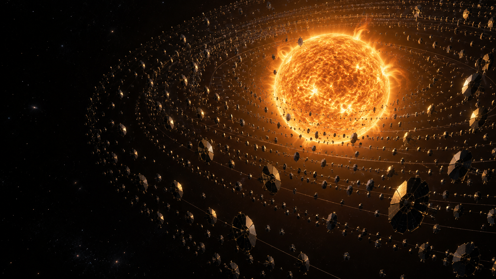
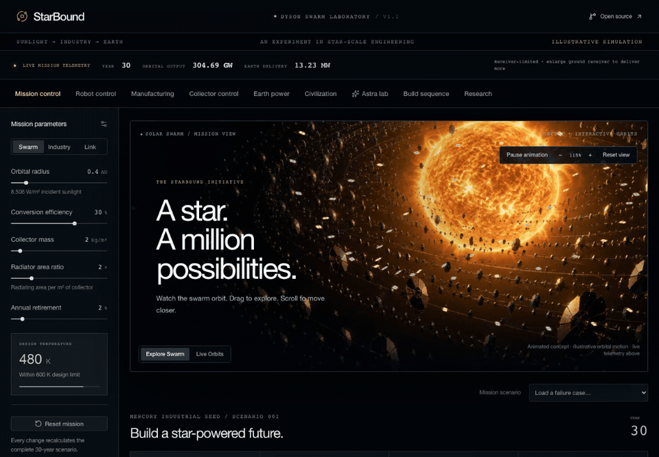
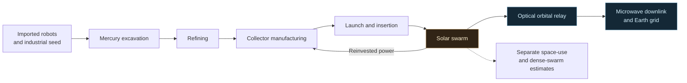
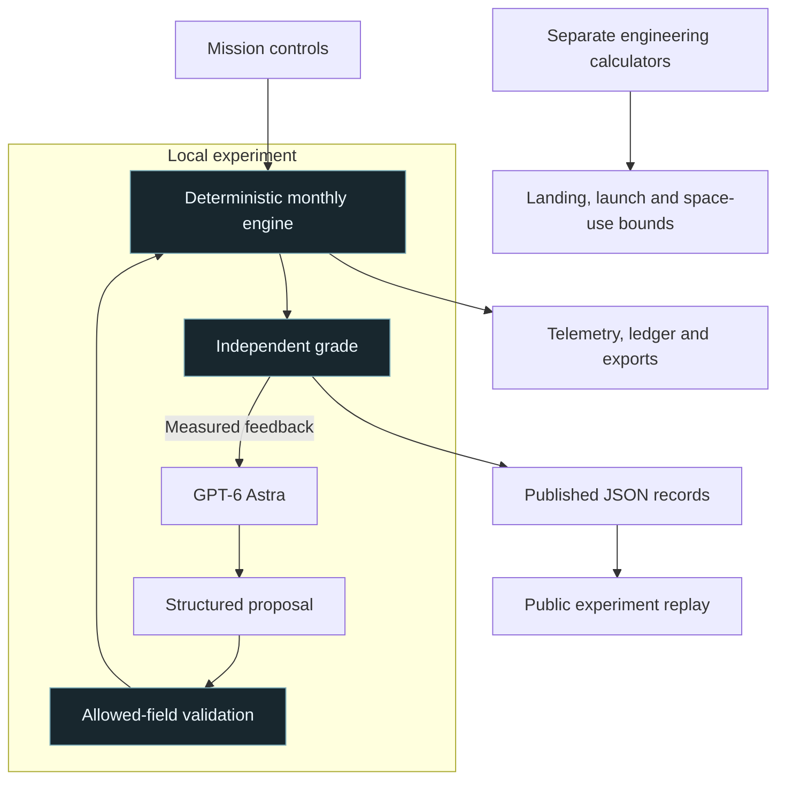

<div align="center">

# StarBound

### Explore a civilization powered by a star.

An interactive Dyson swarm laboratory — from Mercury resources to electricity on Earth.

[**OPEN MISSION CONTROL ↗**](https://starbound.vnmoorthy.chatgpt.site) · [**DOWNLOAD THE PITCH DECK**](https://starbound.vnmoorthy.chatgpt.site/StarBound-Mission-Briefing.pptx) · [**READ THE ARCHITECTURE**](docs/ARCHITECTURE.md)

[](https://github.com/vnmoorthy/starbound/actions/workflows/ci.yml)
[](LICENSE)
[](docs/ASTRA.md)

<a href="https://starbound.vnmoorthy.chatgpt.site"></a>

<sub>Generated concept artwork. The application separates its animated concept view, orbital visualization and numerical simulation.</sub>

</div>

**A megastructure is an engineering problem before it is a spectacle.** StarBound lets you change the industrial plan, break the thermal budget, lose the power beam, and inspect what survives. GPT-6 Astra proposes a policy; a deterministic engine calculates its consequences.

[Try it](https://starbound.vnmoorthy.chatgpt.site) · [60-second tour](#a-mission-in-sixty-seconds) · [Measured results](#astra-proposes-the-engine-measures) · [Run locally](#run-locally) · [Documentation](docs/README.md)

## A mission in sixty seconds

<a href="https://starbound.vnmoorthy.chatgpt.site"></a>

*Recorded from the public application. The opening motion is illustrative concept animation; the power figures are calculated by the engine.* [Watch the MP4](docs/media/starbound-demo.mp4) · [Narration script](docs/ONE-MINUTE-DEMO.md)

| Try this | Watch this change |
| :--- | :--- |
| **Explore the swarm** | Collectors animate automatically. Pan, zoom, pause, or switch to Live orbits. |
| **Resize Earth's receiver** | Set its diameter to 1 km: baseline Earth power falls from **13.23 MW to 3.48 MW**. |
| **Lose the transmission path** | Load *Sun blocks Earth transmission*: Earth delivery becomes **0 W**. |
| **Stop the excavation fleet** | Safe mode reruns the mission with no excavation; production loses its feedstock. |
| **Break the cooling design** | At 0.3 AU and radiator ratio 0.5, the model reaches **783 K** and disables electrical output. |
| **Apply Astra's proposal** | Recompute its recorded policy against the same constraints and inspect the result. |

Nine tabs cover mission control, robots, manufacturing, collectors, Earth power, civilization, Astra, construction and research. The power readout stays visible across them. [Complete control guide](docs/CONSOLE-GUIDE.md)

## From Mercury to Earth



This is a proposed engineering sequence. The monthly model constrains industrial throughput, mass, energy and power delivery. Landing, detailed launcher sizing and near-total-capture estimates are separate calculators. [Twelve-stage process](docs/MERCURY-TO-EARTH.md) · [Equations and assumptions](docs/PHYSICS.md)

## Astra proposes. The engine measures.

**The challenge:** deliver at least **10 MW at month 120** while minimizing mined Mercury ore. The endpoint power already includes an assumed 75% link availability. Astra may change five policy fields; it cannot change the fixed budgets, physical constants or scoring rules.

| Method | Evaluations | Best mined ore | Endpoint Earth power | Recorded time |
| :--- | ---: | ---: | ---: | ---: |
| **GPT-6 Astra** | 3 proposals | **0.128494 Mt** | **13.233 MW** | 162 s |
| GPT-5.6 Sol | 3 proposals | 0.128494 Mt | 13.233 MW | 249 s |
| Conventional grid search | 1,008 simulations | 0.128494 Mt | 13.233 MW | 0.5 s |

**The mining scores tied.** One experiment per model does not establish general superiority or a latency benchmark. Search had a different evaluation budget. The recorded policies reduce mining from the ten-year baseline's **3.92 Mt** while preserving its endpoint delivered power under the fixed receiving assumptions.

The public site includes the real recorded experiments. Live model inference runs through the included local adapter using your own Codex login.

[Protocol](docs/ASTRA.md) · [Astra record](results/astra.json) · [Sol record](results/sol.json) · [Search record](results/search.json) · [Comparison JSON](results/comparison.json)

## One numerical authority



The same TypeScript engine runs in the browser and in Node experiments. It tracks monthly material residuals, production energy, thermal limits, Gaussian-beam capture and receiver caps. React and Three.js render the console; the model supplies proposals and explanations, not physical metrics or grades.

[Detailed architecture and execution plan](docs/ARCHITECTURE.md) · [20 numerical tests](tests) · [Validation](docs/VALIDATION.md) · [Claim audit](docs/CLAIM-AUDIT.md)

## Run locally

Requires **Node.js 24+**.

```bash
git clone https://github.com/vnmoorthy/starbound.git
cd starbound
npm ci
npm run dev -- --hostname 127.0.0.1 --port 3000
```

Open **http://127.0.0.1:3000**. The simulator and recorded experiments work without a model account.

<details>
<summary><strong>Run a live Astra experiment</strong></summary>

```bash
npx codex login status       # If needed: npx codex login
npm run lab
```

Open the temporary local URL printed by the adapter. It binds to loopback, requires a per-process token, and accepts one run at a time. Keep the token private. Inference consumes your own model quota; the public website does not receive your login credentials.

```bash
npm run experiment:astra
npm run experiment:sol
node scripts/summarize-results.mjs
```

[Full setup and comparison protocol](docs/ASTRA.md)

</details>

<details>
<summary><strong>Validate or reproduce the numerical results</strong></summary>

```bash
npm run typecheck
npm run lint
npm test
npm run build
npm run simulate
npm run experiment:search
```

CI runs types, lint, numerical tests and production compilation. Ordinary validation does not call a model. The experimental records retain engine v1.0; the current v1.1 defaults reproduce their baseline behavior.

</details>

## What the power could do

Baseline year-30 Earth delivery is approximately **13.23 MW**, or **0.116 TWh/year**. Illustrative alternatives are **29 million m³ of desalinated water**, **2,109 tonnes of hydrogen**, **29,000 household-years of electricity**, or a **13.23 MW computing-facility load**.

Each uses the entire same electricity budget. These are energy equivalents, not demonstrated plants or solved global problems. [Conversion assumptions](docs/PHYSICS.md#7-what-useful-power-means)

## Read deeper

| If you want to… | Start here |
| :--- | :--- |
| Understand every control | [Console guide](docs/CONSOLE-GUIDE.md) |
| Review the engineering | [Physics](docs/PHYSICS.md) · [Research register](docs/RESEARCH.md) |
| Extend the application | [Architecture](docs/ARCHITECTURE.md) · [Contributing](CONTRIBUTING.md) |
| Reproduce the AI experiment | [Astra protocol](docs/ASTRA.md) · [Recorded evidence](results/comparison.json) |
| Present the project | [PowerPoint](deliverables/StarBound-Mission-Briefing.pptx) · [Demo script](docs/ONE-MINUTE-DEMO.md) |
| Challenge a claim | [Claim audit](docs/CLAIM-AUDIT.md) · [Report a scientific issue](https://github.com/vnmoorthy/starbound/issues/new?template=scientific-correction.yml) |

## Scope and next steps

StarBound is a **reduced-order engineering model**, not a validated construction plan. The seed infrastructure and Earth relay are assumed endowments. Extraction chemistry, robot navigation, manufacturing readiness, collision avoidance, station keeping, relay cooling and lifecycle economics are not validated. Monthly growth stops at 1% projected coverage; near-total-capture estimates use separate bounds.

Next: explicit inventories and factory delays, time-dependent trajectories and beam networks, uncertainty analysis, and a harder repeated Astra/Sol evaluation with held-out failures. [Execution plan](docs/ARCHITECTURE.md#execution-plan)

Built by **[vnmoorthy](https://github.com/vnmoorthy)** with AI assistance at the GPT-6 Astra Hackathon SF, September 8, 2026. [MIT license](LICENSE) · [Third-party notices](THIRD_PARTY.md). No affiliation or endorsement by SpaceX, NASA, OpenAI or the cited researchers is implied.
