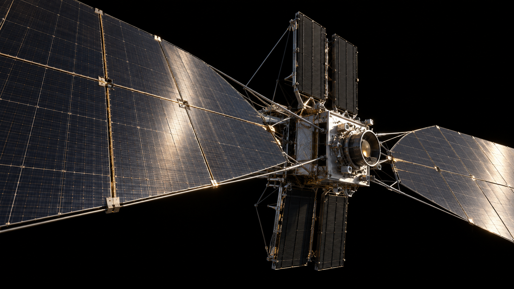
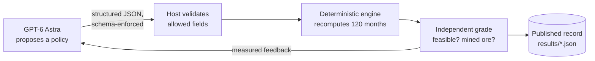
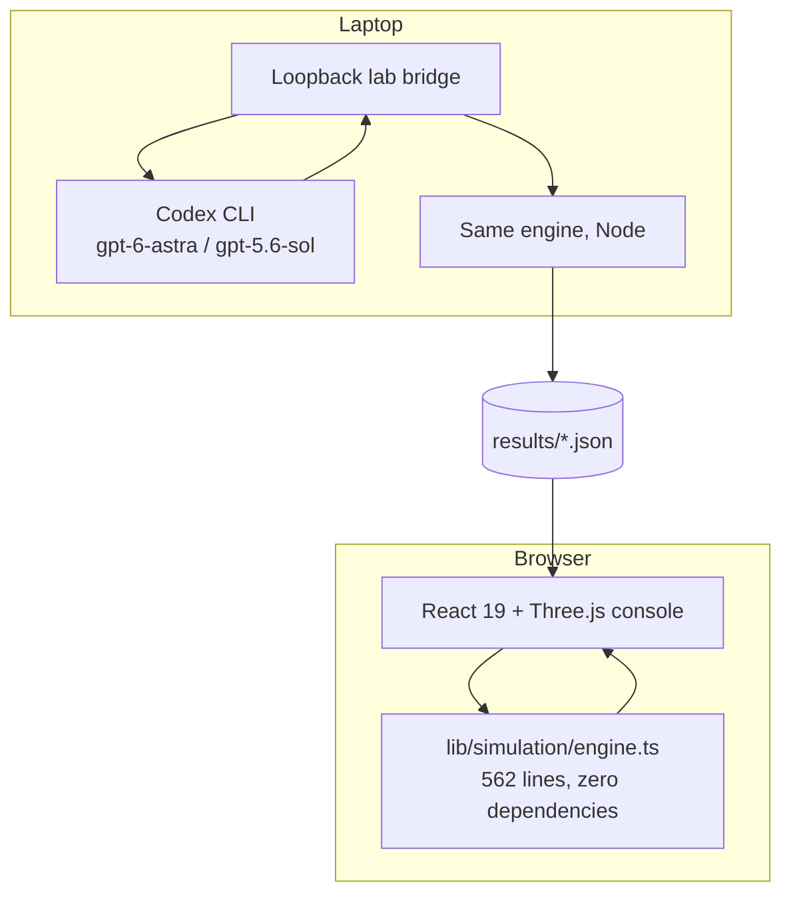

<div align="center">

<a href="https://starbound.vnmoorthy.chatgpt.site">
  
</a>

# StarBound

### Build a civilization powered by a star. Then let the physics argue back.

**An interactive Dyson swarm laboratory.** Robotic industry on Mercury, solar collectors in heliocentric orbit, power beamed to Earth.
Every slider reruns a conservation-checked engineering model. GPT-6 Astra proposes construction policies. The engine grades them. Nothing gets to grade itself.

[](https://starbound.vnmoorthy.chatgpt.site)

[](https://github.com/vnmoorthy/starbound/actions/workflows/ci.yml)
[](tests)
[](package.json)
[](tsconfig.json)
[](components/orbital-scene.tsx)
[](docs/ASTRA.md)
[](LICENSE)

[**Launch the simulator**](https://starbound.vnmoorthy.chatgpt.site) · [**Mission briefing deck**](deliverables/StarBound-Mission-Briefing.pptx) · [**The physics**](docs/PHYSICS.md) · [**The Astra experiment**](docs/ASTRA.md) · [**Architecture**](docs/ARCHITECTURE.md)

*Hero image is generated concept art, labeled as such in the app. Switch to* Live orbits *for the real-time Three.js swarm.*

</div>

---

## Why this exists

Every Dyson sphere video looks incredible and tells you nothing about whether the plan would survive contact with a material ledger, a thermal limit, or a beam that has to cross half an astronomical unit and land on a receiver.

StarBound is the version that has to obey the physics.

- **Mass is conserved.** Ore in equals tailings plus factories plus collectors plus retirements, to within 1e-7 kg, every month, or the audit badge turns red.
- **Energy is budgeted.** Mining, refining, manufacturing and electromagnetic launch each cost joules. Production stalls when the joules run out.
- **Heat is real.** Push collectors to 0.3 AU without enough radiator and their design temperature crosses 600 K. Orbital electrical output goes to zero. No exceptions.
- **Delivery is the hard part.** Switch from an optical relay to direct interplanetary microwave and Earth power collapses from **13.23 MW to 127 W**. Diffraction does not negotiate.
- **The AI does not get to grade its own homework.** GPT-6 Astra proposes. A deterministic TypeScript engine evaluates. Both records are public.

## Sixty seconds in the simulator

<table>
<tr>
<td width="50%"></td>
<td width="50%"></td>
</tr>
<tr>
<td align="center"><sub>Mercury industrial seed (generated concept)</sub></td>
<td align="center"><sub>Collector and radiator (generated concept)</sub></td>
</tr>
</table>

1. **Break the thermal budget.** Orbital radius to 0.3 AU, radiator ratio to 0.5. Watch the design temperature hit 783 K and orbital electricity read exactly zero. Add radiator area to recover.
2. **Lose the beam.** Reset, then switch the Earth link to direct microwave. 13.23 MW becomes 127 W with the same apertures.
3. **Block the Sun.** Set the Earth phase angle to 180°. The line of sight crosses the solar disk and delivery drops to nothing.
4. **Shut down the robots.** Open Robot control and put the excavation fleet in safe mode. Follow the missing feedstock through refining, manufacturing and launch.
5. **Ask Astra.** Open the Astra lab, apply its recorded first proposal, and watch the engine recompute the trajectory it was graded on.

Ten named failure presets ship with the app: collector thermal failure, direct microwave challenge, excavation robots offline, factory assembly shutdown, high pointing jitter, launcher failure at year 3, no precision imports, refinery shutdown, Sun blocks Earth transmission, and the baseline with finite imports.

## What is in the console

| Tab | What you control | What pushes back |
|---|---|---|
| **Mission control** | Orbit radius, efficiency, collector mass, radiator ratio, retirement | Live 3D swarm, design temperature, 30-year power trajectory, bottleneck readout |
| **Robot control** | Excavation availability, safe mode, comms-loss drill, seed delivery, landing mass | Feedstock starvation propagating downstream |
| **Manufacturing** | Refinery and assembly availability, ore yield, factory expansion, energy reinvestment | Conserved mass ledger, collector bill of materials |
| **Collector control** | Launch throughput, rail length, pulse power, insertion | Mass-driver energy, escape and transfer bounds |
| **Earth power** | Transmitter and receiver apertures, pointing jitter, phase geometry, link mode | Gaussian-beam capture, 10 W/m² intensity ceiling, grid cap, occultation |
| **Civilization** | Capture fraction, habitat geometry, computing radiators, kinetic energy | Near-total-capture mass and heat bounds |
| **Build sequence** | Six conceptual missions | The material ledger that has to close |
| **Astra lab** | A bounded policy objective | Independent grading, Sol baseline, brute-force search |
| **Methods** | Nothing. Read. | Every equation, constant, source and open question |

Import or export a complete mission as JSON. Download the monthly trajectory as CSV. No account required.

## The Astra experiment

The challenge: deliver **at least 10 MW to Earth at month 120**, after a 75% availability factor, while mining as little Mercury ore as possible. Astra may change five policy fields. It cannot touch constants, budgets or the grader.



Astra's first proposal found the binding constraint in one round: the fixed Earth receiver saturates, so the baseline was overbuilding. It cut mined ore from **3.92 Mt to 0.128 Mt** while still meeting the target.

| Method | Evaluations | Best mined ore | Endpoint Earth power | Wall clock |
|---|---:|---:|---:|---:|
| **GPT-6 Astra** | 3 proposals | 0.128494 Mt | 13.233 MW | 162 s |
| GPT-5.6 Sol | 3 proposals | 0.128494 Mt | 13.233 MW | 249 s |
| Coarse grid search | 1,008 simulations | 0.128494 Mt | 13.233 MW | 0.5 s |

**They tied.** We are publishing that, because a benchmark you only report when you win is not a benchmark. The mined-ore objective turns out to be flat once factory expansion is zero, so this task could not separate the models. The protocol, the raw records, and the harder follow-up task are all in [docs/ASTRA.md](docs/ASTRA.md).

The point was never that Astra beats Sol at Dyson spheres. The point is a loop where an AI's engineering reasoning has to survive a reality check it does not control, with every attempt on the record.

[Astra record](results/astra.json) · [Sol record](results/sol.json) · [Search record](results/search.json) · [Comparison](results/comparison.json) · [Protocol](docs/ASTRA.md)

## Run it

Requires **Node.js 24+**.

```bash
git clone https://github.com/vnmoorthy/starbound.git
cd starbound
npm ci
npm run dev -- --hostname 127.0.0.1 --port 3000
```

```bash
npm test                    # 20 physical-invariant and boundary tests
npm run typecheck           # strict TypeScript
npm run build               # production build
npm run simulate            # standalone numerical summary
npm run experiment:search   # deterministic 1,008-point reference
```

### Run Astra live on your own machine

The repo ships the official Codex CLI. Live runs use **your** login and quota. The public site never sees your credentials.

```bash
npx codex login status      # or: npx codex login
npm run lab
```

Open the temporary local URL it prints. The bridge binds to loopback only, requires a per-process token, and accepts one run at a time. To regenerate the published records:

```bash
npm run experiment:astra
npm run experiment:sol
node scripts/summarize-results.mjs
```

## How it is built



One numerical authority. The same engine file runs in the browser behind every slider and in Node behind every experiment. A 30-year scenario simulates in about half a millisecond. The model never computes a displayed number.

| | |
|---|---|
| Engine | Deterministic TypeScript, monthly steps, SI units, mass residual checked every step |
| Physics | Inverse-square flux, Stefan–Boltzmann thermal balance, Gaussian-beam diffraction, Mercury escape energetics, Hohmann bounds, rocket equation |
| UI | React 19, Three.js on demand, Tailwind, shadcn primitives, reduced-motion aware, WebGL fallback |
| AI loop | Codex CLI, `--output-schema` enforced JSON, read-only sandbox, array arguments (model output can never become a shell command) |
| Tests | 20 invariants: conservation, thermal cutoff, occultation, link caps, input rejection, grader independence |
| Hosting | OpenAI site hosting, static replay, zero server-side secrets |

Deeper reading: [Architecture](docs/ARCHITECTURE.md) · [Physics](docs/PHYSICS.md) · [Mercury-to-Earth sequence](docs/MERCURY-TO-EARTH.md) · [Research register](docs/RESEARCH.md) · [Validation record](docs/VALIDATION.md)

## What the power could do

At the baseline year-30 snapshot, Earth receives about **13.23 MW**, roughly 0.116 TWh per year. That is one of: 29 million m³ of desalinated water, 2,109 tonnes of hydrogen, 29,000 household-years of electricity, or a 13 MW compute facility. Pick one. They share the same budget. Conversion assumptions are in [the physics doc](docs/PHYSICS.md#7-what-useful-power-means).

## Where the model stops

This is a reduced-order engineering model, not a construction plan.

The seed plant, imported precision components and Earth relay are assumed endowments. Extraction chemistry, real manufacturing readiness, collision-free trajectories, station keeping, relay cooling, weather and lifecycle economics are not validated. The moving swarm is a representative orbit sample, not an integrated ephemeris. Dense-swarm radiative feedback on the star, the open problem in Wright's review, is outside the sparse model. Robot motion is aggregate availability, not navigation.

No construction date, energy price, demand, or model superiority is claimed. If you can break an invariant or source a better constant, [open an issue](https://github.com/vnmoorthy/starbound/issues). Reproducible failures are the most useful contribution.

## Roadmap

- [ ] Harder Astra task with a held-out fault revealed after round one, scored on cumulative delivered energy with a real interior optimum
- [ ] Thermal margin enforced in the grader, not just documented
- [ ] Explicit inventories and factory lead times
- [ ] Return-link geometry and orbital trajectories
- [ ] Uncertainty bands on every headline number
- [ ] Independent domain review

## Research and inspiration

- Jason T. Wright, [*Dyson Spheres*](https://arxiv.org/abs/2006.16734), Serbian Astronomical Journal 200 (2020)
- NASA/JPL, [planetary physical parameters](https://ssd.jpl.nasa.gov/planets/phys_par.html)
- NASA, [Mercury surface mineralogy](https://ntrs.nasa.gov/citations/20160002643)
- NASA OTPS, [space-based solar power assessment](https://www.nasa.gov/organizations/otps/space-based-solar-power-report/)
- Kurzgesagt, [*How to Build a Dyson Sphere*](https://www.youtube.com/watch?v=pP44EPBMb8A)

## Contributing and license

Built by [**vnmoorthy**](https://github.com/vnmoorthy) at the GPT-6 Astra Hackathon SF, September 8, 2026, with AI assistance. See [CONTRIBUTING.md](CONTRIBUTING.md) and [THIRD_PARTY.md](THIRD_PARTY.md). Code is [MIT](LICENSE). Mission-briefing aesthetic is original; no affiliation with SpaceX, NASA, OpenAI or the cited authors is implied.

<div align="center">

**If the numbers pushing back made you smile, a star helps other people find this.**

[](https://github.com/vnmoorthy/starbound)

</div>
