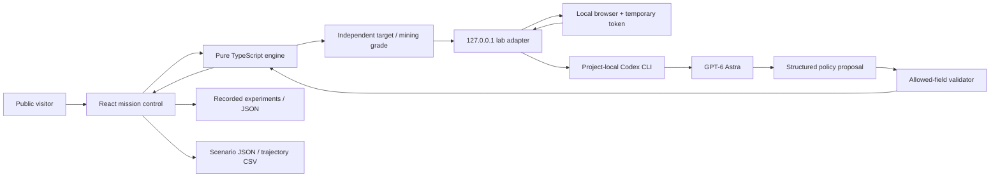

# System architecture and execution plan

StarBound has one numerical authority: a pure, deterministic TypeScript engine. The UI, command-line experiments, recorded results and presentation all consume it. Language-model text never determines displayed power or material quantities.

## Runtime boundaries

The public deployment renders the simulator and replays without a key. Actual inference uses the local machine’s authenticated Codex session through the included adapter. The model CLI runs with a read-only sandbox. There is no public endpoint carrying the owner's model credential and no background inference charge when a visitor loads the site.

### Source ownership

| Module | Responsibility | Important boundary |
|---|---|---|
| `lib/simulation/engine.ts` | Constants, mission validation, thermal/link calculations, industrial flow, accounting, output summary | No network, model calls or global mutable state |
| `lib/simulation/experiment.ts` | Allowed policy fields, fixed challenge, host-side evaluation and score | Reject changes to fixed evidence/budgets |
| `components/mission-control.tsx` | Mission state, controls, timeline, numerical metrics, imports/exports | Recalculate all results after valid edits |
| `components/orbital-scene.tsx` | Canvas projection of sampled circular orbits | Schematic; not a trajectory engine |
| `components/mission-views.tsx` | Build sequence, link comparison, exclusive energy-use equivalents, methods | Distinguish assumptions from measurements |
| `components/astra-lab.tsx` | Local experiment request, progress state, replay and apply action | Apply through numerical validation |
| `scripts/astra-runner.mjs` | Structured Codex inference and three successive proposals | Fixed command arguments; model output cannot execute code |
| `scripts/lab-server.mjs` | Loopback HTTP bridge and per-process authorization | Exact local origins, body cap, one active run |
| `scripts/search-baseline.mjs` | Conventional coarse-grid reference | Declared 1,008 engine evaluations |
| `tests/*.test.mjs` | Physical invariants, pathological inputs, model boundary tests | Test independent constraints, not UI snapshots |
| `results/` | Reproducible baseline and measured experiments | Never store credentials or private chain-of-thought |
| `deliverables/` | Final presentation and exported briefing assets | Derived from the same source results |

## Data model

`Mission` is the complete serializable input contract. `validateMission` merges known defaults with recognized fields, rejects unknown keys, requires finite bounded numbers and a known transmission architecture. Numeric bounds are declared in `BOUNDS`. The full merged mission accompanies every exported result.

`Snapshot` stores a monthly endpoint: active/retired hardware, ore, tailings, used imports, factory mass/capacity, power, cumulative process energy, grid energy, stage utilization and current limiting constraint. The initial snapshot is year zero. `Simulation` includes all snapshots, thermal validity, link diagnostics, accounting audit and explicit warnings. The version is included in every record.

`Trial` stores model identifier, protocol, timestamps, fixed challenge, initial mission, each successive proposal, independently recomputed result, grade and elapsed time. These are successive revisions in one task, not independent samples. Invalid output fails explicitly. Local detailed diagnostics remain in ignored `.build/runs/` directories.

## User journey

1. Open the demo: baseline final state and complete trajectory are immediately available.
2. Scrub or play the timeline. The displayed metrics all reference the same selected monthly state.
3. Change swarm, industry or link parameters. The model recalculates the complete mission.
4. Inspect the construction ledger or the transmission budget. Select mutually exclusive uses of the same electricity.
5. Read a recorded Astra experiment, then apply any valid policy. The numerical result is recomputed locally.
6. For live inference, run the local adapter and open its temporary local URL. The objective is contextual guidance; the displayed scoring contract remains fixed.
7. Export the complete mission/summary or monthly CSV for independent examination.

Error paths: invalid/oversized imported JSON produces an explicit message; a failed model run retains its error status; absent local adapter produces setup instructions; inaccessible replay does not disable the simulator; thermally invalid hardware produces zero orbital electricity; occulted geometry produces zero Earth-link power; exhausted inputs stop new production.

## Security and privacy

The development bridge binds only to loopback and authorizes every inference request with a cryptographically random per-process token. Only `http://127.0.0.1:3000` and `http://localhost:3000` are allowed browser origins. The token is printed only in the local startup URL, is not committed and never authenticates against OpenAI itself. The public website cannot call the bridge under its own origin. Requests are bounded and model selection is allowlisted. Runs are serial.

The runner uses Node `spawn` with an argument array and `shell:false` semantics. Schema and result paths are generated by the host inside a private directory. Structured proposals are validated again by the host before evaluation. The model cannot change imports, seed power, conversion efficiencies or grader rules through its output. Inference uses the included official CLI, not an extracted OAuth credential.

Known operational boundary: the CLI itself is a general local coding tool. Read-only sandboxing and the instruction not to use tools reduce scope; this adapter is intended for a trusted local demonstration, not hostile multi-tenant use. A production hosted agent should use scoped Responses API tools and account-specific spend controls rather than expose this bridge.

## Execution plan

### Release 1 — complete hackathon artifact

- Establish the source references and explicit numerical boundaries.
- Implement SI-unit collection, cooling, monthly mass/energy flow and Earth propagation.
- Assert accounting, power bounds, input validation, shutdowns and reproducibility.
- Build functional orbital visualization, controls, timeline, construction story and exportable results.
- Connect a real local Astra proposer to the host grader; record all three revisions.
- Run Sol using the same protocol; run conventional search with its budget disclosed.
- Produce a SpaceX-inspired, original mission-briefing PowerPoint with editable diagrams, charts and tables.
- Build and publish the exact source state; set GitHub description, topics and live-demo URL; keep initial authored commits attributed to `vnmoorthy`.
- Rehearse the canonical failure/recovery demo. Make model failures and unproven technology visible.

### Release 2 — improve scientific fidelity

Implement separate inventories and production queues; factory build/commissioning delays; grade-specific feedstock and import bills; mission phase-dependent reinvestment; a stoppable production policy; reliability distributions and repair/recycling flows. Add an integration-step refinement study before interpreting fast bootstrap trajectories. Acceptance: mass/energy invariants across time-step sizes, convergence of key outputs, and independent engineering review of default intensities.

### Release 3 — orbital and power-network model

Introduce ephemerides, launch-window and transfer calculations, collision/spacing checks and station-keeping mass. Replace a single fixed line of sight with time-integrated geometry. Model Mercury return power, multiple relays/receivers, pointing, occultation, weather availability and relay radiator mass. Acceptance: compare numerical trajectories and link calculations against independently trusted astrodynamics/optics tools.

### Release 4 — an evaluation platform

Provide a versioned task suite with unseen material, thermal and delivery failures; identical exposed tools; separate per-model token/latency/cost budgets; repeated trials; held-out perturbations and conventional optimizers. Score engineering feasibility, constraint violations, resource efficiency and recovery after steering. Publish failures and confidence intervals. Native mid-turn steering can be an optional Astra-specific interface experiment; it is not implemented or claimed by the current sequential CLI loop.

### Release 5 — research and economics

Add techno-economic and lifecycle accounting with explicit geographical and temporal assumptions. Evaluate terrestrial solar/storage and Earth-orbit SBSP on comparable delivered-energy boundaries. Validate Mercury extraction and manufacturing against laboratory data. Treat fleet construction as a research proposal requiring domain collaborators, not a near-term product roadmap with promised deployment dates.

## Testing and deployment

Use Node 24+, `npm ci`, `npm run typecheck`, `npm test`, `npm run build`. `npm run simulate` prints an independent summary; `npm run experiment:search` regenerates the deterministic search and default baseline. Live inference is opt-in and consumes the signed-in user's model quota; CI must not invoke it.

GitHub Actions checks types, numerical tests and production compilation. The Sites build is packaged from the same pushed commit used to save the deployment version. Generated credentials, run diagnostics, dependency trees, local environment files and build intermediates are excluded from Git. No automatic deploy workflow or push of model secrets is required.

## Performance target

At most 1,200 monthly steps and 1,600 representative particles. One default numerical simulation should run under 100 ms on the development laptop; report measured timing and environment in `results/verification.json`. UI rendering is capped around 30 fps and reduced-motion preferences stop automatic orbit motion. These bounds keep scientific state independent of visual particle density.

## StarBound v1.1 expansion

The presentation, public name, exports and repository are branded StarBound. The existing Sites project is reused with slug `starbound`.

New operational modules:

| Module | Role |
|---|---|
| `lib/simulation/engineering.ts` | Landing rocket equation, circular transfer, mass-driver sizing, random-overlap coverage and space-use bounds |
| `components/operations-views.tsx` | Robot, manufacturing, collector and civilization control tabs; ten mission failure fixtures |
| `components/orbital-scene.tsx` | Three.js 3D visualization with instanced collectors, procedural solar appearance, bloom and orbit cameras |
| `public/assets/` | Two explicitly labeled AI-generated engineering concept images |
| `docs/RESEARCH.md` | Literature register, retrieved-source limitations and consequences for implementation |

Robot, refinery and plant availability changes enter the same monthly engine and exports. Landing, mass-driver and civilization sizing remain separate calculations with visible boundaries; they do not silently change the scored v1 records. The v1.0 records retain their original numerical version; model v1.1 adds availability defaults of one and preserves baseline behavior.

The 3D renderer caps representative collectors at 2,400 and display pixel ratio at 1.5, targets roughly 30 frames/s, pauses on user request and respects reduced-motion preference. Rendered sizes, stellar appearance and time are illustrative. All orbits are circular samples; there is no N-body integration, collision avoidance or heat simulation in the renderer. An explicit WebGL failure message leaves the numerical controls usable. Native GPU rendering must be evaluated on target devices before making performance or photorealism claims.

Before extending the prototype into a high-fidelity research tool, implement and independently validate: phase-specific inventory/queue models; extraction chemistry; robot task and mobility dynamics; factory thermal balance; reliable time-dependent trajectories; beam networks and thermal sinks; self-shadowing, back-reaction and survival under radiation pressure; and lifecycle economics. Track these as separate acceptance gates rather than interpreting more detailed imagery as more accurate physics.
